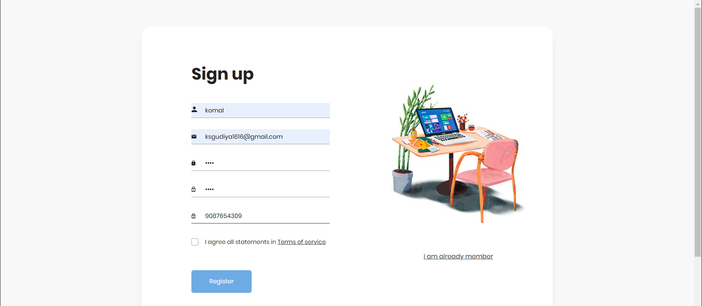
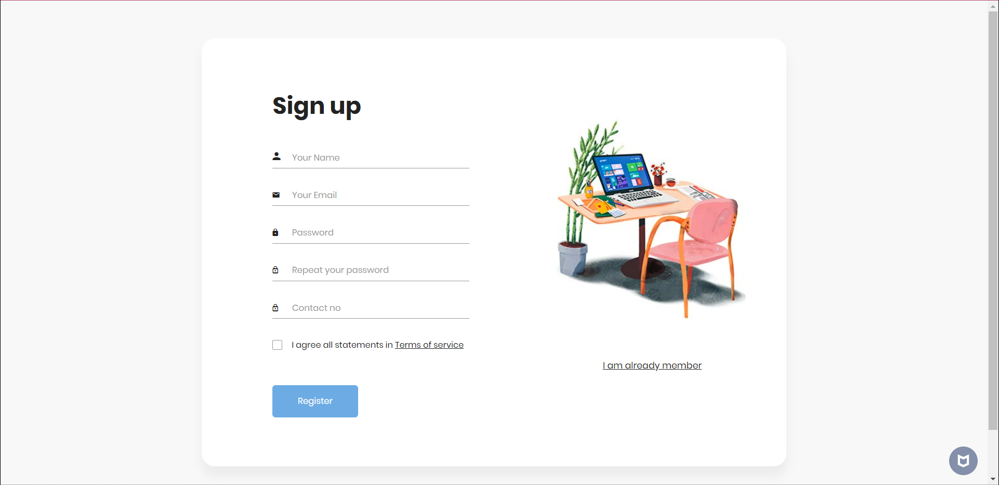
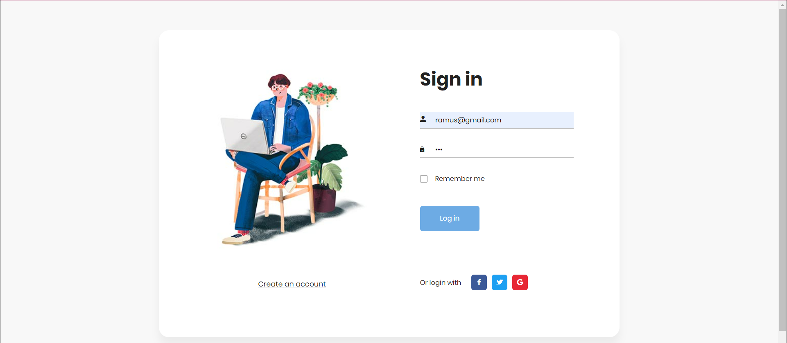
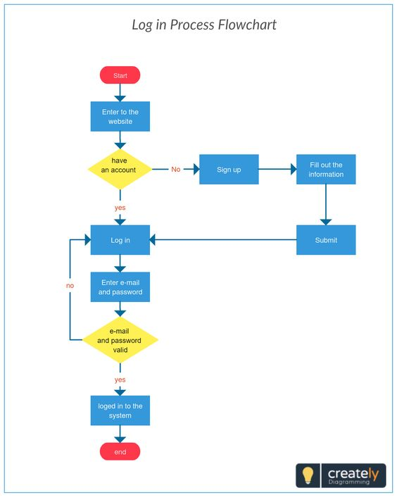

# Login_Registration_page
Login and registration page using servlets,jsp and Jdbc

Login Page is very common among any type of secured applications and its widely used on the internet for authenticating the user before presenting the secured pages of the web applications. 
A login screen is a web page or an entry page to a web/mobile application that requires user identification and authentication, regularly performed by entering a username and password combination.

1. [Abstract](#Abstract)
2. [Introduction](#Introduction)
3. [Getting Started](#GettingStarted)
4. [Technology used](#Technology_Used)
5. [Steps to Develop loginpage](#Steps_to_Develop_loginpage)
6. [Login page and Registration page usage](#Login_page_and_Registration_page_usage)
7. [Deployment](#Deployment)
8. [Flowchart](#Flowchart)
9. [Contributing](#Contributing)
10. [Authors](#Authors)
11. [Acknowledgements](#Acknowledgements)

## Abstract
Completed to the login page and registration page.Login Page is the page where you can get authenticated before the access of the application.Login Page takes user input and passes the data to server-side program. The authentication is done by server-side program and authentication results (message) is displayed to user on the website site login form. If user is authenticated they are forwarded to the secure section of the website.
Login form  provides the link for the registration page. If website user is already not registered then he/she can register by visiting the registration section of the website.

## Introduction
Using Java, we can prepare elegant web pages that serve the purpose of registering/logging in to the application, and upon authorized authenticated credentials, the rest of the application screens can be seen. Hence it is much essential to have a login form to accept the inputs from users and then validate the data. For validating the data, we can use javascript at the client-side. i.e. like validating mandatory inputs (username is required/password is required) /if the username is of email pattern then need to validate whether entered text satisfies the email pattern etc., 

Once client-side validations are over, entered credentials are checked against the database stored data. This process can be done only on the server-side. That means those kinds of validations need to be sent as a request to the server and the code needs to be written in Servlet. Usually, as login form credentials are sensitive and should be hidden while passing, it has to get sent as a POST method. In this article, let us see we can design a basic login form and do processing via a servlet. Let us see the required pages to fulfill this feature

## Getting Started
These instructions will get you a copy of the project up and running on your local machine for development and testing purposes. See deployment for notes on how to deploy the project on a live system.

## Technology Used
  1. Java
  2. HTML
  3. CSS
  4. JavaScrpit
  5. Also Using servlets and jsp for creating this project.

##  Prerequisites
1. EclipseIDE Installation
2. Create a Dynamic Project File in Eclipse
3. Create a java class for registration
4. Adding a mysql jar for connectivity

## Installing
## EclipseIDE Installation

Following is a step by step guide to download and install Eclipse IDE:

Step 1) Installing Eclipse
Open your browser and type https://www.eclipse.org/
Step 2) Click on “Download” button.
Step 3) Click on “Download 64 bit” button
Step 4) Click on “Download” button
Step 5) Install Eclipse.

Click on “downloads” in Windows file explorer.
Click on “eclipse-inst-win64.exe” file.
Step 6) Click on “Eclipse IDE for Java Developers”
Step 7) Click on “INSTALL” button
Step 8) Click on “LAUNCH” button

##Login page and Registration page usage

 Form-Tag:-The <form> tag is used to create a form for user.In this project we use form tag for login and registration page.here user can input their information for registration.
  
 Input-Field:-Input tag specifies an input field where the user can enter data.The <input> element is the most important form element.In this project
  we have multiple input tags like Name,Email,Password,Contact Number.In Name text field we have to fill our name.In email field we have to fill email id for registration.
  In password field we have to fill strong password for create an account.In contact field we have to fill our mobile number for authentication.

   Buttons:-In this project we use multiple buttons.Like the login button is use for log-in in website.Using a register button to register user information.
  
 ## Deployment
   For creating an account:-
    
   For Signin:-
   
   
   After signin:-
    
    

## Flowchart
 
  
  [MongoDB ](#example)-Database

  [Express ](#example)-Server Framework

  [VueJs ](#example)- Web Framework

  [NodeJs](#example)-Server Environment 

## Authors

- [@Komalsaini](https://github.com/KomalSaini16)-Learner
  
  
## Acknowledgements

 #### I would like to express my deepest gratitude to every coder.

 #### References -Quick Notepad tutorial.
